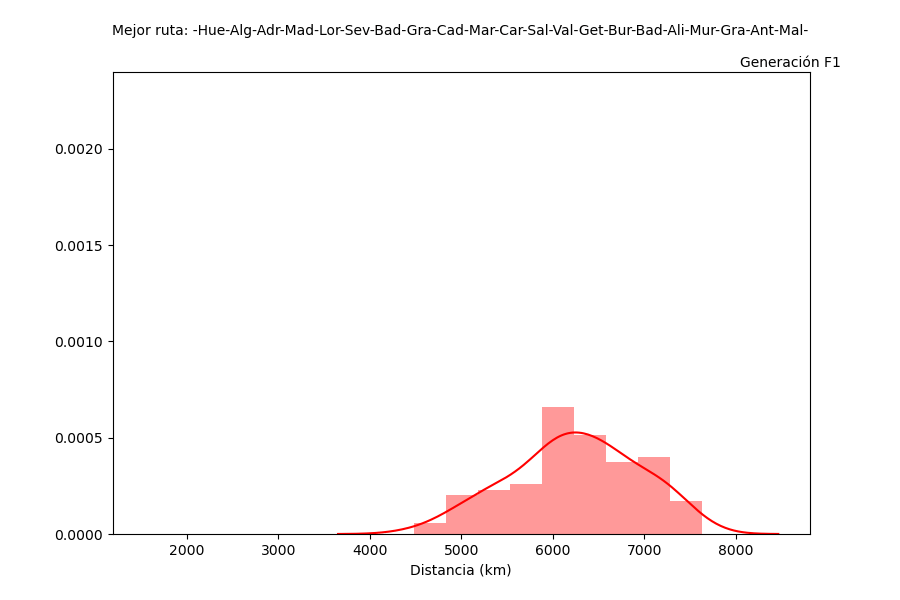

# TravelingSalesmanGA
This python script allows you to implement a genetic algorithm to the [Traveling Salesman Problem](https://en.wikipedia.org/wiki/Travelling_salesman_problem) for a bunch of cities. It was created with educational purposes.

## General info
The script work as follows:
1. Geolocation of the group of cities of interest with the [geopy library](https://github.com/geopy/geopy)
2. Start an initial generation (generate random routes)
3. Calculate population fitness
4. Mating pool (Deterministic tournament selection or Fitness Proportionate Selecion with/without the Elitism Strategy)
5. Crossover and mutation over the population
6. Generate next population and repeat steps 3-5
## Technologies
* Python 3.8.5

## Example of use
To run the algorithm for a list of cities in the terminal and save an animated graph, as well as a html file with the route representation:

```
$ cd ../TravelingSalesmanGA
$ python TravelingSalesmanSolverAnimation.py Sevilla Cadiz Malaga Granada Marchena Madrid Alicante Valladolid Badalona Burgos Getafe Badajoz Salamanca Algeciras Carmona Antequera Lorca Murcia Grazalema Adra Huelva

```
That will return after a while the best route found, hopefully, similar to this:

```
$ Se ha terminado el proceso
$ ['Badalona', 'Alicante', 'Murcia', 'Lorca', 'Adra', 'Granada', 'Malaga', 'Antequera', 'Grazalema', 'Algeciras', 'Cadiz', 'Sevilla', 'Marchena', 'Carmona', 'Huelva', 'Badajoz', 'Salamanca', 'Valladolid', 'Burgos', 'Madrid', 'Getafe']
$ Con una distancia de 2314.580758623623 kilometros
```





In order to just get the best route use:

```
$ cd ../TravelingSalesmanGA
$ python TravelingSalesmanSolver.py Sevilla Cadiz Malaga Granada Marchena Madrid Alicante Valladolid Badalona Burgos Getafe Badajoz Salamanca Algeciras Carmona Antequera Lorca Murcia Grazalema Adra Huelva

```

In order to create a virtual environment with conda and install all Python libraries that the scripts depend on:
```
$ git clone https://github.com/currocam/TravelingSalesmanGA
$ conda create --name env_nombre python=3.8.5
$ conda activate env_nombre
$ cd ../TravelingSalesmanGA
$ pip install -r requirements.txt

```
